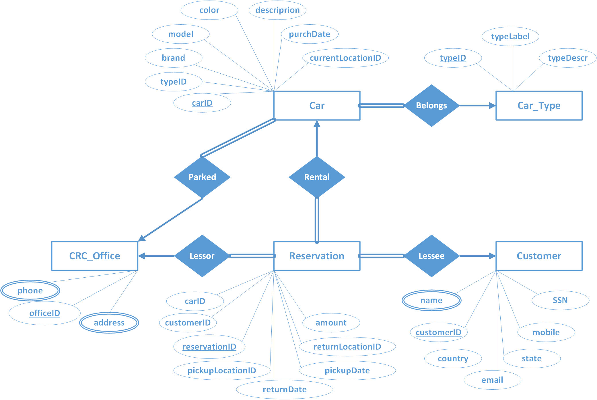

# car-rental-database-sql-

Description of the Problem 
A car rental company (let's call it CRC) wants to develop a relational database to monitor customers, rentals, fleet and locations.
 
CRC's fleet consists of cars of different types. A car is described via a unique code (VIN), a description, color, brand, model, and date of purchase. A car may belong to one (exactly one) vehicle category (compact, economy, convertible, etc.). Each category is described by a unique ID, a label and a detailed description. CRC has several locations around the globe. Each location has a unique ID, an address (street, number, city, state, country) and one or more telephone numbers. CRC should also store in this database its customers. A customer is described by a unique ID, SSN, Name (First, Last), email, mobile phone number and lives in a state and country. Customers rent a car, which they pickup from a location and return it another location (not necessarily the same.) A rental is described by a unique reservation number, it has an amount and contains the pickup date and the return date.
Entity-Relationship Diagram (ERD) 
Use the Entity-Relationship Diagram (ERD) to model entities, relationships, attributes, cardinalities, and all necessary constraints. Use any tool you like to draw the ERD. 

Database Diagram
Use SQL Workbench to create the tables and insert a few records into the tables to test your queries below. You will have to hand in the CREATE TABLE statements. 

Now answer to the following 

Query A
Show the reservation number and the location ID of all rentals in 5/20/2015 

Query B
Show the first and the last name and the mobile phone number of those customers that have rented a car in the category that has label = 'luxury' 

Query C
Show the total amount of rentals per location ID (pick up) 

Query D
Show the total amount of rentals per car's category ID and month 

Query E
For each rental’s state (pick up) show the top renting category 

Query F
Show how many rentals there were in May 2015 in ‘NY’, ‘NJ’ and ‘CA’ (in three columns) 

Query G
For each month of 2015, count how many rentals had amount greater than this month's average rental amount 

Query H
For each month of 2015, show the percentage change of the total amount of rentals over the total amount of rentals of the same month of 2014 

Query I
For each month of 2015, show in three columns: the total rentals’ amount of the previous months, the total rentals’ amount of this month and the total rentals’ amount of the following months 

